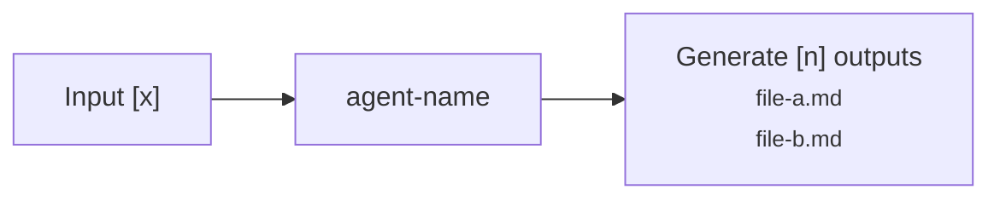
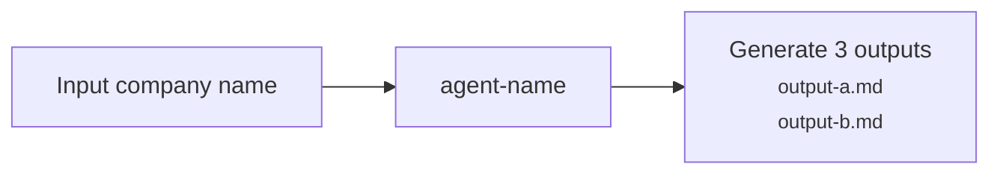

Generate or update the portfolio README for an agent or skill.

## Step 1 — Identify the agent

If the user has not already specified an agent or skill name, ask:

> "Which agent or skill should I generate or update the portfolio README for? Point me to the file or I'll search for it."

Wait for their response before continuing.

Locate the agent/skill file on disk. Search `.claude/agents/`, `.claude/commands/`, and `.claude/skills/`. If the file cannot be found, tell the user and ask them to confirm the path.

Read the agent/skill file in full before proceeding.

## Step 2 — Branch: new file or existing?

Derive the portfolio filename from the agent filename stem (e.g. `interview-analysis.md` → `portfolio/interview-analysis.md`).

Check whether `portfolio/[agent-name].md` already exists.

- **Does not exist → follow Path A (Steps 3–6)**
- **Exists → follow Path B (Step 7)**

Do not run both paths. Stop after the path you take.

---

## PATH A — Generate new portfolio file

### Step 3 — Pre-fill from agent file

The output file must follow this exact structure — every section in this order, no additions or omissions:

```markdown
# [Agent / Skill Name]

---

## Purpose

[One sentence copied verbatim from the README.md row for this agent.]

---

## Workflow

[One-sentence plain-text caption explaining the flow.]



---

## Iterations

| Challenge | Fix | Result |
|---|---|---|
| [row] | [row] | [row] |

---

## Evals

- **Method:** [description]
- **Coverage:** [which outputs were evaluated and which are pending]
- **Report:** [link]

---

## Sample Output

- [Output title](path)

---

## Outcome

**Accuracy / Quality:** [one sentence]

**Value saved:** ~€X,XXX/year — task reduced from X hrs to X mins (incl. verification)<br/>
*Assumptions: run ~X times/[period] · [frequency rationale] · pegged to PM salary*

---

## Links

- [Agent instructions](path) — prompt Claude uses at runtime
- [Eval report](path) — latest verification run
```

Pre-fill the following without asking the user:

**Title** — agent/skill display name from the `name` frontmatter or first heading.

**Purpose** — copy the description verbatim from the README.md row for this agent. Do not rewrite or summarise — the README row is already the canonical description.

**Links — agent instructions** — always `.claude/agents/[agent-name].md` (or the correct subfolder).

**Links — latest eval report** — search `projects/*/06- evals/` for files whose name contains the agent name or output type. If found, link to the most recent. If not found, use the placeholder.

**Sample outputs** — search `projects/*/04- analysis/` and `projects/*/05- outputs/` for files likely produced by this agent (match by naming convention or agent type). List up to 3 recent files with relative paths. If none found, leave the placeholder.

### Step 4 — Draft Iterations from git history

Run:
```bash
git log --follow --oneline .claude/agents/[agent-name].md
git log --follow -p .claude/agents/[agent-name].md
```

Read the diff output. For each commit that changed the agent file, identify what was added, removed, or restructured. Map changes to probable challenges and fixes — e.g. a new rule being added implies a problem that rule was solving.

Draft the Iterations as a markdown table with three columns — ordered highest impact → lowest:

| Challenge | Fix | Result |
|---|---|---|
| [Describe the agent's behavior or approach that caused the failure — then the consequence. Lead with what the agent did, not what the output looked like. e.g. "Customer sentiment analysis relied on Brave Search snippets — which surface page-level summaries, not individual user reviews — leaving platforms behind **authentication walls** (Reddit, App Store, Instagram) inaccessible."] | **[Bold the single mechanism word — the fix name, not the whole phrase.]** [One sentence describing what changed. e.g. "**Integrated Bright Data API** across B2C platforms (App Store, Play Store, Reddit, X, Instagram, Trustpilot) and B2B platforms (G2, Trustpilot, LinkedIn, Reddit)."] | [One crisp outcome sentence. e.g. "Sentiment section grounded in up to 30 platform-sourced verbatims per run."] |

**Column rules:**
- **Challenge:** Agent-behavior framing — "Agent attempted X", "Citations relied on Y", "Analysis depended entirely on Z." Never start with the output symptom ("Output contained..."). Always include a concrete example of the bad output or the gap it created. Bold only the single term that names the failure mode (e.g. `**SWOT analysis**` not `**competitive SWOT analysis**`).
- **Fix:** Bold the mechanism word (one word or short fixed term — e.g. `**Introduced**`, `**Banned**`, `**Integrated**`, `**Forced**`). Then one sentence on what specifically changed — not why it was a problem.
- **Result:** Outcome only — what is now true. One sentence, no hedging. Use numbers from the diff if they exist; do not invent metrics.

Follow the language rules from `CLAUDE.md → Working Style → Language` for all three columns. Order rows highest impact → lowest. Do not invent metrics; use numbers from the diff if they exist.

If the git log shows no meaningful changes (single commit or no history), leave one placeholder row.

### Step 5 — Ask the user four questions

Present all questions in one message — do not ask sequentially:

> "I've pre-filled what I can from the agent file and git history. Four questions before I write the file:
>
> **1. Workflow** — describe the inputs, outputs, and any agents that feed into or receive from this one. I'll build the Mermaid diagram from your description. (e.g. 'Takes interview transcripts + company context files → produces 1 analysis file per transcript → consumed by int-research-eval and research-synthesis')
>
> **2. Iterations** — here's what I inferred from git history:
>
> | Challenge | Fix | Result |
> |---|---|---|
> | [drafted challenge — hyper-specific with concrete example] | **[drafted fix mechanism.]** [one sentence on what changed] | [drafted result] |
> | [...] | **[...]** | [...] |
>
> Correct, add to, or replace any item. Reply 'looks right' to keep as-is.
>
> **3. Evals** — did you run a formal eval on this agent? If yes, describe the method briefly and I'll link to the report. Reply 'skip' to leave this section blank.
>
> **4. Frequency** — how often do you run this agent? (e.g. '2x per week', 'once per sprint', '3x per month')
> My estimates for the time calculation — correct me if wrong:
> - Manual time: [estimated based on task type — e.g. '~3 hours — involves sourcing, reading, and synthesising multiple external sources']
> - Automated time (including human verification): [estimated — e.g. '~25 minutes: agent runs in ~5 mins, plus ~20 mins to review and verify output']"

**Do not write anything until the user has responded to all four questions.**

### Step 6 — Write the portfolio file

Assemble the complete file using:
- Pre-filled content from Step 3
- Mermaid diagram built from the user's workflow description (Q1)
- Iterations table with user corrections applied (Q2)
- Evals section populated from Q3, or placeholder text if they replied 'skip'
- Value saved calculated from Q4 (see below)

**Mermaid diagram rules**

Build a `flowchart LR` diagram from the user's workflow description:
- One node per distinct input, this agent, and its direct output — omit downstream consumers
- Node labels are action-oriented (verb-led): "Input company name", "Generate 3 context files" — not display names
- Agent node: use the agent filename as the label (e.g. `create-company-agent`) — no second line needed
- Output node: put the action description first, then list file names in `<small>` tags with each file on its own line using `<br/>` — no dot separators (e.g. `"Generate 3 context files<br/><small>file-a.md<br/>file-b.md<br/>file-c.md</small>"`)
- Input nodes with multiple items: use `<br/>` between items inside the label
- Add a one-sentence plain-text caption above the diagram (before the code fence) explaining the flow in plain language



**Value saved calculation**

Use the confirmed manual time, automated time (including verification), and user-supplied frequency:

```
hourly_rate    = 70000 / 1760        # €70K ÷ 1,760 working hours/year = ~€39.77/hr
time_saved_min = manual_mins - automated_mins
runs_per_year  = frequency converted to annual (e.g. 2x/week × 48 weeks = 96)
annual_value   = (time_saved_min / 60) × runs_per_year × hourly_rate
```

Round to the nearest €50. Format as:

> *Cost savings:** ~€X,XXX/year — task reduced from X hrs to X mins (incl. verification)
> *Assumptions: run ~X times/[period] · [frequency rationale] · pegged to PM salary*

If the user did not supply frequency, leave the placeholder unchanged.

Save to `portfolio/[agent-name].md`. If the `portfolio/` folder does not exist, create it first.

Confirm:
```
portfolio/[agent-name].md created.
```

---

## PATH B — Update existing portfolio file

### Step 7 — Update sections

Read `portfolio/[agent-name].md` in full.

Ask the user:

> "A portfolio README already exists for this agent. What changed? (e.g. 'new iteration to add', 'updated the workflow', 'ran a formal eval', 'outcome metrics changed') — I'll update only those sections."

Wait for their response. Edit only the sections they identify. Do not touch sections they did not mention.

Confirm:
```
portfolio/[agent-name].md updated. Sections changed: [list].
```

---

## Rules

- Never write the portfolio file until the user has responded to Step 5 questions (Path A).
- Never run both Path A and Path B — branch once and stop.
- Never modify `.claude/agents/` files or source data — read only.
- Build the Mermaid diagram from the user's description, not by inferring from agent file steps. The user may reference agents that do not yet exist.
- For the Iterations table, infer from git diff as a starting draft only — always show the draft to the user for confirmation before writing.
- Apply the same description style as README rows: verb-led, no labels, no nested clauses.
