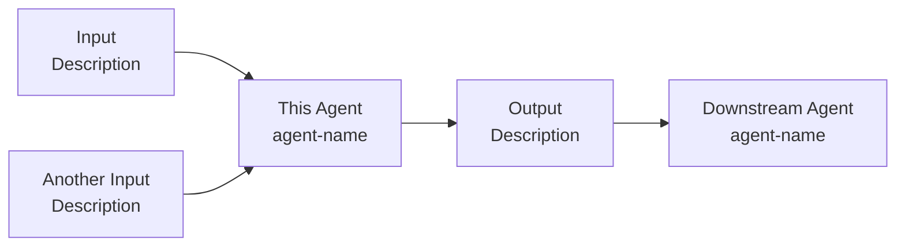

Generate or update the portfolio README for an agent or skill.

## Step 1 — Identify the agent

If the user has not already specified an agent or skill name, ask:

> "Which agent or skill should I generate or update the portfolio README for? Point me to the file or I'll search for it."

Wait for their response before continuing.

Locate the agent/skill file on disk. Search `.claude/agents/`, `.claude/commands/`, and `.claude/skills/`. If the file cannot be found, tell the user and ask them to confirm the path.

Read the agent/skill file in full before proceeding.

## Step 2 — Branch: new file or existing?

Derive the portfolio filename from the agent filename stem (e.g. `interview-analysis.md` → `portfolio/interview-analysis.md`).

Check whether `portfolio/[agent-name].md` already exists.

- **Does not exist → follow Path A (Steps 3–6)**
- **Exists → follow Path B (Step 7)**

Do not run both paths. Stop after the path you take.

---

## PATH A — Generate new portfolio file

### Step 3 — Pre-fill from agent file

Read `templates/portfolio-readme-template.md`.

Pre-fill the following without asking the user:

**Title** — agent/skill display name from the `name` frontmatter or first heading.

**Purpose** — copy the description verbatim from the README.md row for this agent. Do not rewrite or summarise — the README row is already the canonical description.

**Links — agent instructions** — always `.claude/agents/[agent-name].md` (or the correct subfolder).

**Links — latest eval report** — search `projects/*/06- evals/` for files whose name contains the agent name or output type. If found, link to the most recent. If not found, use the placeholder.

**Sample outputs** — search `projects/*/04- analysis/` and `projects/*/05- outputs/` for files likely produced by this agent (match by naming convention or agent type). List up to 3 recent files with relative paths. If none found, leave the placeholder.

### Step 4 — Draft Iterations from git history

Run:
```bash
git log --follow --oneline .claude/agents/[agent-name].md
git log --follow -p .claude/agents/[agent-name].md
```

Read the diff output. For each commit that changed the agent file, identify what was added, removed, or restructured. Map changes to probable challenges and fixes — e.g. a new rule being added implies a problem that rule was solving.

Draft a numbered Iterations list — ordered highest impact → lowest:

1. **[Hyper-specific problem statement — not "inaccurate output" but the exact failure mode, e.g. "Agent cited competitors from the company's own press releases, producing overconfident claims like 'no other competitor offers...'".]** — **[Bold the fix mechanism.]** [Infer the qualitative result from the fix. Use outcome-focused language grounded in what the fix achieves — e.g. "Reduced error rate on qualitative claims", "All claims now grounded in independently sourced evidence", "Every figure is now auditable by source and date", "Outputs are fully reproducible across runs." Do not invent metrics. If a number exists in the diff or file, use it.]

**Language rules for drafting iterations:**
- Be hyper-specific about what went wrong — not "inaccurate" or "skewed" but the exact failure and what it produced
- Include a short concrete example showing the failure (e.g., a hallucinated claim, a broken link, a wrong figure)
- Bold the fix mechanism — not headers or general emphasis
- Use standard AI/ML terminology where it applies (e.g., hallucination, context window) — do not invent terms or use jargon HR won't recognise (e.g., avoid "coverage gate", "full query status map")
- When describing a shift from model-generated to source-logged data (e.g., URL citations, fact retrieval), frame it as moving from a **stochastic** to a **deterministic** approach — this communicates systematic thinking to technical hiring managers without requiring AI expertise to understand
- Order by impact: item 1 should be the most significant improvement
- Call search latency "latency" not "overhead"

If the git log shows no meaningful changes (single commit or no history), leave one placeholder item.

### Step 5 — Ask the user four questions

Present all questions in one message — do not ask sequentially:

> "I've pre-filled what I can from the agent file and git history. Four questions before I write the file:
>
> **1. Workflow** — describe the inputs, outputs, and any agents that feed into or receive from this one. I'll build the Mermaid diagram from your description. (e.g. 'Takes interview transcripts + company context files → produces 1 analysis file per transcript → consumed by int-research-verification and research-synthesis')
>
> **2. Iterations** — here's what I inferred from git history:
>
> 1. **[drafted problem — hyper-specific with concrete example]** — **[drafted fix]**. [drafted result]
> 2. **[...]** — **[...]**.
>
> Correct, add to, or replace any item. Reply 'looks right' to keep as-is.
>
> **3. Evals** — did you run a formal eval on this agent? If yes, describe the method briefly and I'll link to the report. Reply 'skip' to leave this section blank.
>
> **4. Frequency** — how often do you run this agent? (e.g. '2x per week', 'once per sprint', '3x per month')
> My estimates for the time calculation — correct me if wrong:
> - Manual time: [estimated based on task type — e.g. '~3 hours — involves sourcing, reading, and synthesising multiple external sources']
> - Automated time (including human verification): [estimated — e.g. '~25 minutes: agent runs in ~5 mins, plus ~20 mins to review and verify output']"

**Do not write anything until the user has responded to all four questions.**

### Step 6 — Write the portfolio file

Assemble the complete file using:
- Pre-filled content from Step 3
- Mermaid diagram built from the user's workflow description (Q1)
- Iterations table with user corrections applied (Q2)
- Evals section populated from Q3, or placeholder text if they replied 'skip'
- Value saved calculated from Q4 (see below)

**Mermaid diagram rules**

Build a `flowchart LR` diagram from the user's workflow description:
- One node per distinct input, this agent, output, and connected agent
- Label nodes with a display name and a brief descriptor on a second line using `\n`
- Keep it to direct connections only — no transitive hops



**Value saved calculation**

Use the confirmed manual time, automated time (including verification), and user-supplied frequency:

```
hourly_rate    = 70000 / 1760        # €70K ÷ 1,760 working hours/year = ~€39.77/hr
time_saved_min = manual_mins - automated_mins
runs_per_year  = frequency converted to annual (e.g. 2x/week × 48 weeks = 96)
annual_value   = (time_saved_min / 60) × runs_per_year × hourly_rate
```

Round to the nearest €50. Format as:

> `~€X,XXX/year — task reduced from X hrs to X mins (incl. verification), run ~X times/month (based on €70K PM salary)`

If the user did not supply frequency, leave the placeholder unchanged.

Save to `portfolio/[agent-name].md`. If the `portfolio/` folder does not exist, create it first.

Confirm:
```
portfolio/[agent-name].md created.
```

---

## PATH B — Update existing portfolio file

### Step 7 — Update sections

Read `portfolio/[agent-name].md` in full.

Ask the user:

> "A portfolio README already exists for this agent. What changed? (e.g. 'new iteration to add', 'updated the workflow', 'ran a formal eval', 'outcome metrics changed') — I'll update only those sections."

Wait for their response. Edit only the sections they identify. Do not touch sections they did not mention.

Confirm:
```
portfolio/[agent-name].md updated. Sections changed: [list].
```

---

## Rules

- Never write the portfolio file until the user has responded to Step 5 questions (Path A).
- Never run both Path A and Path B — branch once and stop.
- Never modify `.claude/agents/` files or source data — read only.
- Build the Mermaid diagram from the user's description, not by inferring from agent file steps. The user may reference agents that do not yet exist.
- For the Iterations table, infer from git diff as a starting draft only — always show the draft to the user for confirmation before writing.
- Apply the same description style as README rows: verb-led, no labels, no nested clauses.
