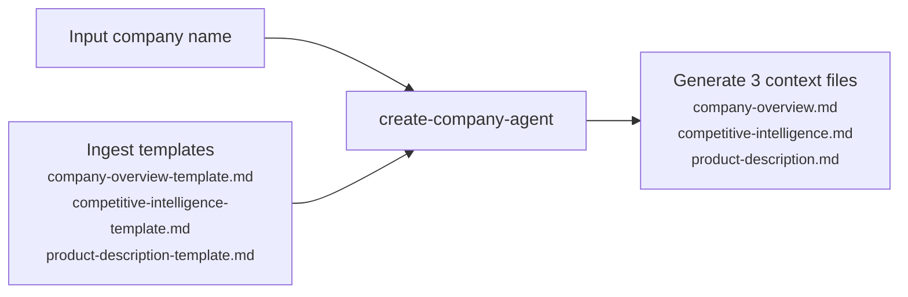

# Company Context Agent

---

## Purpose

Conducts automated deep-dives into a company, its competitors, market landscape, and products. Serves as context for other agents (e.g. Interview Analysis Agent, Survey Analysis Agent).

---

## Workflow

Input a company name → agent researches and generates three context files used by downstream agents.

---

## Iterations

| Challenge | Fix | Result |
|---|---|---|
| Agent attempted a SWOT analysis, but search snippets **unable to substantiate qual claims** — producing hallucinations like "ASOS has weaker EU logistics than Zalando." | Shifted approach to **restrict the model to verifiable data extraction**, while allowing qualitative claims only when explicitly attributed to external sources. | Every claim is traceable to a specific source. |
| Citations relied on the model generating URLs from memory — a **stochastic** process that produced broken or hallucinated links. | **Introduced two deterministic registries.** `fact_registry.json` logs every source at retrieval (URL, title, date, key quote) — cited downstream as `SRC:id`. `quotes_registry.json` logs every verbatim user quote before analysis (exact text, platform, date) — cited as `Q-id`. | Every sourced claim and verbatim quote is auditable by source, date, and exact text. |
| Agent wrote **overconfident competitive claims** — e.g. "no other competitor offers X" — sourced only from the subject company's own press releases. | **Banned the subject company's domain from all competitor searches.** Every competitor now requires an independent third-party source. | Reduced error rate on competitive claims. |
| Parallel Brave Search calls hit **rate limits** mid-run, causing the agent to skip queries and hallucinate data to fill the gaps. | **Forced sequential searches with `sleep 2` latency between every call.** | 100% data retrieval; 14-second added latency is a negligible trade-off. |
| Figures without provenance — stale statistics, aggregator estimates, inferences from adjacent sources, and search failures — were written into outputs without caveats, silently promoting **unverified data** into confident claims in downstream synthesis. | **Introduced a seven-label classification system**: `[UNVERIFIED]` for aggregator figures and unverified competitor claims, `[>2YR]` for stale data, `[ASSUMPTION: reasoning]` for inferences, `[DATA UNAVAILABLE]` for search gaps, `[SEARCH FAILED]` for tool failures, and `[URL NOT RETRIEVED]` for missing links. | Provenance caveats travel with each figure into downstream synthesis by agents and humans, without needing re-verification. |
| Native web search had **high token consumption** (~95K tokens per run). | **Switched to Brave Search API**, which returns compact structured JSON snippets. | **~50% reduction** in search-related token consumption, reducing cost and overcoming context window limits. |
| Customer sentiment analysis relied on Brave Search snippets — which surface page-level summaries, not individual user reviews, resulting in findings that were too **surface-level** to be useful. | **Integrated Bright Data API** to access behind-the-wall social data across B2C platforms (e.g., App Store, Play Store, Reddit) and B2B platforms (e.g,. G2, Trustpilot, LinkedIn). Thematic analysis uses pre-defined codes for common product feedback categories (deductive reasoning), combined with emergent codes emergent (inductive reasoning). | Sentiments analysis **grounded in rich social data**; Hybrid deductive and inductive coding framework **minimised token consumption** while ensuring we **captured novel patterns.** |
| Agent ignored rule about sequential searches, scraping all social media platforms **simultaneously**, leading to unnecessary API usage. | Replaced with a **sequential loop (search → scrape → count → gate)**, ensuring only one platform is processed at a time before proceeding to the next. | **Reduced redundant API calls** |
| Agent wrote quant figures from search snippets — which reflect **cached** earlier editions, not the live page. | **Forced a live fetch** using `mcp__Bright_Data__extract` for all frequently updated analyst report figures. | Cited figures now reflect the current live page. |

---

## Evals

- **Method:** [`ext-research-eval`](../.claude/agents/ext-research-eval.md) — Uses a **two-pronged** evaluation approach: 1. **Machine-led evaluation**: Conducts **objective** checks (e.g., quant computations, link and citation coverage, template adherence). 2. **Human-led evaluation**: Conducts **subjective** checks based on HHH (Honesty, Helpfulness, Harmlessness) to assess its true usefulness to PMs. 
- **Coverage:** Run on Zalando competitive-intelligence.md and company-overview.md — product-description.md eval pending.
- **Reports:**
  - [2026-04-18 — Zalando competitive intelligence](../projects/Zalando/06-%20evals/2026-04-18-ext-research-verification-competitive-landscape.md)
  - [2026-04-21 — Zalando company overview](../projects/Zalando/06-%20evals/2026-04-21-ext-research-eval-company-overview.md)

---

## Sample Output

- [Zalando — company-overview.md](../projects/Zalando/01-%20company%20context/company-overview.md)
- [Zalando — competitive-intelligence.md](../projects/Zalando/01-%20company%20context/competitive-intelligence.md)
- [Zalando — product-description.md](../projects/Zalando/01-%20company%20context/product-description.md)

---

## Outcome

✅ **Accuracy / Quality:** While still requiring spot checks in early stage of dev, now every claim is grounded in an independently sourced, date-stamped, auditable citation.

✅ **Cost savings:** **~€1,150/year** — process time reduced from 6 hrs to 75 mins (incl. verification) 
*Assumptions: run ~6 times/year · ~6 new companies/year · pegged to PM salary*

---

## Links

- [Agent instructions](../.claude/agents/create-company.md) — prompt Claude uses at runtime
- [Eval report — competitive intelligence](../projects/Zalando/06-%20evals/2026-04-18-ext-research-verification-competitive-landscape.md) — latest verification run
- [Eval report — company overview](../projects/Zalando/06-%20evals/2026-04-21-ext-research-eval-company-overview.md) — latest verification run

