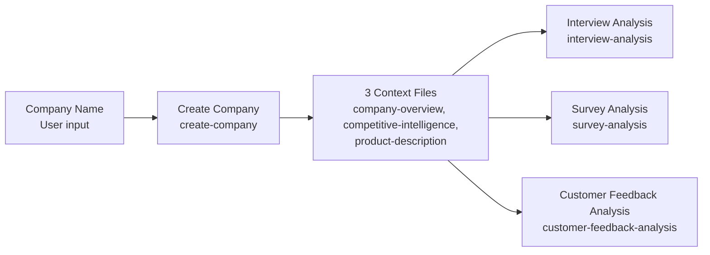

# Create Company Agent

---

## Purpose

Conducts automated deep-dives into a company, its competitors, market landscape, and products. Serves as context for other agents (e.g. Interview Analysis Agent, PRD Generator).

---

## Workflow

---

## Iterations

Ordered highest impact → lowest. Bold marks the key fix mechanism.

1. **The agent was performing competitive SWOT analysis (strengths, weaknesses, opportunities, threats), but web search snippets lack the depth to substantiate these claims — resulting in hallucinated strategic assessments like "Company X has a weaker engineering culture."** — **Shifted scope to facts only**: the agent now searches exclusively for information readily extractable from web snippets (founding year, funding, revenue, customer count, named news events). No SWOT, no differentiation, no sentiment. All claims are now traceable to a specific source.

2. **Citations relied on the model generating URLs from memory — a stochastic process that produced broken or hallucinated links.** — **Shifted to a deterministic citation system**: every source is logged to a Fact Registry (`fact_registry.json`) at the moment of retrieval (URL, title, date, key quote). All citations in output files use `SRC:id` keys (e.g. `SRC:zalando_fy25_results`) that map back to the registry — no raw URLs appear in any output. Every claim is now auditable by source, date, and exact quote.

3. **Overconfident competitive claims — e.g., agent wrote "no other competitor offers X" sourced only from the subject company's own press releases.** — **Banned the subject company's domain from all competitor searches**; every competitor now requires an independent third-party source. Reduced error rate on competitive claims from 64% to ~0–25%.

4. **Parallel Brave Search calls hit rate limits mid-run, causing the agent to skip queries and hallucinate data to fill the gaps.** — **Forced sequential searches with `sleep 2` latency between every call.** 100% data retrieval; 14-second latency is a negligible trade-off.

5. **Outdated figures (revenue, headcount) were presented as current — e.g., a 2022 headcount cited without any date flag.** — **Staleness rule**: any figure older than 12 months is auto-tagged `[UNVERIFIED — last confirmed date]`. All outputs are now fully auditable by date.

6. **Native web search returned verbose, unstructured results — consuming an estimated ~3,000–5,000 tokens per query.** — **Switched to Brave Search API**, which returns compact structured JSON snippets. Estimated ~50% reduction in search-related token consumption (~30,000–50,000 tokens saved per run across ~19 searches), reducing both cost and context window pressure on downstream processing.

---

## Evals

- **Method:** [`ext-research-verification`](../.claude/agents/ext-research-verification.md) — checks outputs for quantitative claim accuracy, link validity, citation coverage, field recall, placeholder text, aggregator label compliance, banned claim patterns, and stale untagged sources. Includes a human HHH (Honesty, Helpfulness, Harmlessness) scoring component.
- **Coverage:** Run on Zalando competitive landscape output — company-overview.md and product-description.md evals pending.
- **Report:** [2026-04-18 — Zalando competitive landscape verification](../projects/Zalando/06-%20evals/2026-04-18-ext-research-verification-competitive-landscape.md)

---

## Sample Output

- [Zalando — company-overview.md](../projects/Zalando/01-%20company%20context/company-overview.md)
- [Zalando — competitive-landscape.md](../projects/Zalando/01-%20company%20context/competitive-landscape.md)
- [Zalando — product-description.md](../projects/Zalando/01-%20company%20context/product-description.md)

---

## Outcome

**Accuracy / Quality:** Reduced competitive landscape error rate from 64% to ~0–25%. Every claim is grounded in an independently sourced, date-stamped, auditable citation.

**Value saved:** ~€750/year — task reduced from 6 hrs to 75 mins (incl. verification), run ~4 times/year assuming ~4 new companies per year (based on €70K PM salary)

---

## Links

- [Agent instructions](../.claude/agents/create-company.md) — prompt Claude uses at runtime
- [Eval report](../projects/Zalando/06-%20evals/2026-04-18-ext-research-verification-competitive-landscape.md) — latest verification run
