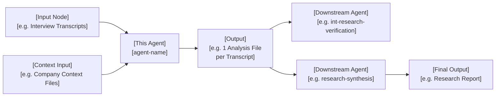

# [Agent / Skill Name]

> One-sentence summary of what it does and for whom.

---

## Purpose

[Lead with what the agent does and the object it acts on. Follow with the mechanism or constraint that makes it work. End with the outcome or metric it produces. 1–3 sentences — no labels, no bullet points. Example: "Analyses user research interviews for pain points, bright spots, and project-specific dimensions — one file per participant, with verbatim quotes. No synthesis."]

---

## Workflow

> Keep nodes to the inputs, this agent, its outputs, and any direct upstream/downstream agents. Remove unused branches.

---

## Iterations

| Challenge | Fix | Result |
|---|---|---|
| [e.g., 64% error rate on qualitative claims] | [e.g., Banned company's own domain for competitor descriptions] | [e.g., Error rate dropped to ~20%] |
| [e.g., Stale figures presented as current] | [e.g., Figures >12 months tagged `[UNVERIFIED]`] | [e.g., All outputs now fully auditable by date] |

---

## Evals

[Leave blank if no formal eval was run — or describe the method, rubric, and link to the eval report below.]

- **Method:** [e.g., Structured rubric with HHH scoring / Manual audit against primary sources / Python script checking all quantitative claims]
- **Report:** [Eval report](../projects/[CompanyName]/06- evals/[eval-file].md)

---

## Sample Output

> Link to one or more real outputs produced by this agent.

- [Output title](../projects/[CompanyName]/[path-to-output])
- [Output title](../projects/[CompanyName]/[path-to-output])

---

## Outcome

**Accuracy / Quality:** [e.g., "Reduced competitive landscape error rate from 64% to ~0–25%"]

**Value saved:** [e.g., "~€X,XXX/year — task reduced from X hrs to X mins, run ~X times/month (based on €70K PM salary)"]

---

## Links

- [Agent instructions](.claude/agents/[agent-name].md) — prompt Claude uses at runtime
- [Eval report](../projects/[CompanyName]/06- evals/[eval-file].md) — latest verification run
