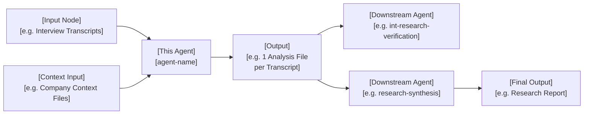

# [Agent / Skill Name]

---

## Purpose

[Copy the description from the README.md row for this agent — no rewriting. Example: "Analyses user research interviews for pain points, bright spots, and project-specific dimensions — one file per participant, with verbatim quotes. No synthesis."]

---

## Workflow

> Keep nodes to the inputs, this agent, its outputs, and any direct upstream/downstream agents. Remove unused branches.

---

## Iterations

Ordered highest impact → lowest. Bold marks the key fix mechanism.

1. **[Hyper-specific problem statement — e.g., "Agent cited competitors using the company's own press releases, producing overconfident claims like 'no other competitor offers...'"](Short concrete example of the failure)** — **[Bold the exact fix mechanism]**. [Result: metric or outcome if known.]

2. **[...]** — **[...]**.

---

## Evals

[Leave blank if no formal eval was run — or describe the method, rubric, and link to the eval report below.]

- **Method:** [e.g., Structured rubric with HHH scoring / Manual audit against primary sources / Python script checking all quantitative claims]
- **Report:** [Eval report](../projects/[CompanyName]/06- evals/[eval-file].md)

---

## Sample Output

> Link to one or more real outputs produced by this agent.

- [Output title](../projects/[CompanyName]/[path-to-output])
- [Output title](../projects/[CompanyName]/[path-to-output])

---

## Outcome

**Accuracy / Quality:** [e.g., "Reduced competitive landscape error rate from 64% to ~0–25%"]

**Value saved:** [e.g., "~€X,XXX/year — task reduced from X hrs to X mins, run ~X times/month (based on €70K PM salary)"]

---

## Links

- [Agent instructions](.claude/agents/[agent-name].md) — prompt Claude uses at runtime
- [Eval report](../projects/[CompanyName]/06- evals/[eval-file].md) — latest verification run
